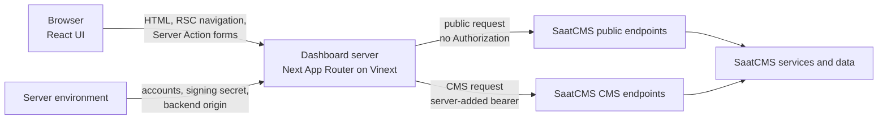
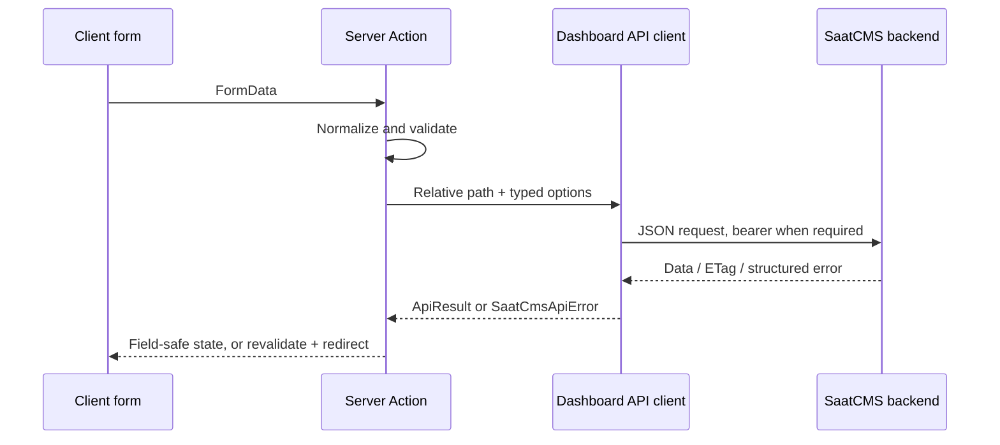

# Application Architecture

This guide explains how the SaatCMS Admin Dashboard is put together and why
the main boundaries exist. For access-control details, see
[Security and access](security-and-access.md). For setup and commands, start
with the [README](../README.md).

## What this application is

The dashboard is a server-rendered web client for the existing SaatCMS
backend. It does not own Content, Channel, EPG, metadata, or playback data. It
provides an operations interface and translates browser interactions into
backend API requests.

The application supports two experiences:

- **Account workspace:** editor and admin accounts can use CMS management
  routes. The backend still decides whether a particular operation is allowed.
- **Visitor workspace:** visitors can use health, metadata, and playback tools
  backed only by public endpoints. No CMS bearer credential is selected or
  sent.



The important boundary is the dashboard server. Browser code never constructs
an upstream CMS bearer header and cannot choose an arbitrary backend URL.

## Runtime and rendering model

The source uses the Next.js App Router and React 19. The project is built and
served through Vinext, with Vite providing the build pipeline. The Vite setup
registers Vinext plus Cloudflare RSC/SSR environments and the worker entry in
[`vite.config.ts`](../vite.config.ts). Render runs the production process with
`vinext start`, as declared in [`render.yaml`](../render.yaml).

| Layer             | Responsibility                                                                          | Typical files                                                                                                                        |
| ----------------- | --------------------------------------------------------------------------------------- | ------------------------------------------------------------------------------------------------------------------------------------ |
| Server Components | Read session state, fetch initial data, and render routes                               | [`app/(dashboard)`](<../app/(dashboard)>)                                                                                            |
| Client Components | Handle interactive forms, pending state, menus, and local UI state                      | [`components`](../components)                                                                                                        |
| Server Actions    | Validate submitted data, call SaatCMS, revalidate pages, and redirect                   | [`app/login/actions.ts`](../app/login/actions.ts), [`lib/content/actions.ts`](../lib/content/actions.ts), feature `actions.ts` files |
| Server libraries  | Parse environment, resolve accounts, sign sessions, and enforce outbound request policy | [`lib`](../lib)                                                                                                                      |
| Shared models     | Describe backend responses and map form state into API payloads                         | [`lib/types.ts`](../lib/types.ts), [`lib/content/model.ts`](../lib/content/model.ts)                                                 |

Files are Server Components unless they opt into `"use client"`. Mutations opt
into `"use server"`; this keeps validation, bearer selection, and upstream
network access out of the client bundle.

## Route structure

Next route groups organize access policy without changing public URLs.

```text
app/
|-- login/                         unauthenticated entry point
|-- (dashboard)/                  any signed dashboard session
|   |-- dashboard/                overview
|   |-- system/                   public health/readiness through the server
|   |-- tools/                    public metadata and playback tools
|   `-- (cms)/                    account session required
|       |-- content/              Content management
|       |-- channels/             Channel and per-channel EPG management
|       `-- epg/                  schedule entry point
`-- page.tsx                      redirects to login or overview
```

[`app/(dashboard)/layout.tsx`](<../app/(dashboard)/layout.tsx>) requires either
an account or visitor session and renders the application shell. The nested
[`app/(dashboard)/(cms)/layout.tsx`](<../app/(dashboard)/(cms)/layout.tsx>)
requires an account session. A visitor who enters a CMS URL directly is
redirected to the overview with an account-required notice.

The shell also hides CMS navigation in visitor mode, but that is a usability
feature rather than an authorization control. The server layout and API client
remain authoritative.

## Read and mutation flows

### Server-rendered reads

1. A route's Server Component loads the current session when its behavior
   depends on the principal.
2. It calls [`saatCmsRequest`](../lib/api.ts) with a relative backend path.
3. The API client applies path, authentication, timeout, and error policy.
4. The component renders successful data, an empty state, or a normalized
   error presentation.

Independent reads commonly use `Promise.allSettled`. This lets the overview,
system page, and detail screens preserve useful results when a sibling request
fails. For example, a failed readiness check does not erase the liveness
result.

### Server Action mutations



Each feature keeps domain-specific mapping close to its action:

- Content form semantics and inheritance mapping live in
  [`lib/content/model.ts`](../lib/content/model.ts).
- Content mutations live in
  [`lib/content/actions.ts`](../lib/content/actions.ts).
- Channel mutations live in
  [`components/channels/actions.ts`](../components/channels/actions.ts).
- EPG mutations and time validation live in
  [`components/epg/actions.ts`](../components/epg/actions.ts) and
  [`components/epg/time.ts`](../components/epg/time.ts).
- Public metadata and playback actions live beside their pages under
  [`app/(dashboard)/tools`](<../app/(dashboard)/tools>).

On success, a mutation revalidates the affected route and redirects to a stable
detail or list URL. On validation or backend failure, it returns a small state
object that the form can render without exposing an internal exception.

## The upstream API boundary

[`lib/api.ts`](../lib/api.ts) is the only shared path to the SaatCMS backend.
Keeping the policy in one place avoids small authentication and error-handling
differences between features.

It provides these guarantees:

- accepts only safe relative paths and rejects absolute, protocol-relative,
  backslash, or traversal paths;
- permits explicitly unauthenticated calls only to `/`, `/health`, `/ready`,
  and `/api/v1/mw/*`;
- rejects caller-supplied `Authorization` headers;
- selects an account secret on the server for authenticated requests;
- rejects missing sessions and visitor CMS requests before `fetch`;
- sends JSON request bodies, `If-Match`, and feature headers consistently;
- disables upstream caching with `cache: "no-store"`;
- aborts requests after the configured timeout;
- returns response status, `ETag`, and `X-Request-Id` alongside data; and
- normalizes structured backend, non-JSON, timeout, and network failures.

The public tools still run as Server Actions. Their calls set
`authenticated: false`, so custom playback context headers can be sent without
ever introducing a CMS bearer.

## Optimistic concurrency with ETags

Content, Channel, and EPG edits use backend versions rather than last-write-wins
updates:

1. A detail read captures the response `ETag` in `ApiResult`.
2. The page passes that version to the edit form.
3. The Server Action forwards it as `If-Match` on `PATCH`.
4. The backend accepts the current version or returns its documented conflict.
5. The UI asks the operator to reload/review instead of replaying the mutation
   automatically.

This is intentional. Automatic retries could overwrite another operator's
change with stale form data. Creates do not need an ETag. Deletes follow the
backend contract: Content deletion is leaf-only, Channel deletion requires an
explicit confirmation query, and EPG deletion uses the program identifier.

## Error model

All upstream failures become
[`SaatCmsApiError`](../lib/api.ts), containing an HTTP status, stable error code,
safe message, and optional request ID. Feature actions retain the parts needed
for inline recovery; server-rendered pages use
[`ApiErrorCard`](../components/api-error-card.tsx). Unknown exceptions receive
generic dashboard messages.

The dashboard does not reinterpret backend business rules. Backend codes such
as write conflicts, overlapping EPG entries, forbidden operations, and
playback denials remain the source of truth. The UI adds context only when it
can provide a safer recovery path, such as explaining why recursive Content
deletion is unavailable.

## Environment and deployment boundary

[`lib/env.ts`](../lib/env.ts) is marked `server-only` and validates configuration
on first use. It exposes no `NEXT_PUBLIC_*` variables.

| Variable                     | Purpose                                                        |
| ---------------------------- | -------------------------------------------------------------- |
| `SAATCMS_API_BASE_URL`       | Fixed upstream origin; a trailing slash is removed             |
| `CMS_API_KEYS`               | Editor/admin account registry and their backend bearer secrets |
| `DASHBOARD_SESSION_SECRET`   | Independent HMAC key for dashboard cookies                     |
| `SAATCMS_REQUEST_TIMEOUT_MS` | Upstream deadline, 1 to 120 seconds                            |

Local values belong in an ignored `.env`; only placeholders appear in
[`.env.example`](../.env.example). Render supplies the same values through the
service environment described by [`render.yaml`](../render.yaml). Environment
validation is deliberately server-side and returns one generic configuration
error rather than echoing invalid secret material.

## Where to make a change

| Change                                       | Start here                                                                                    |
| -------------------------------------------- | --------------------------------------------------------------------------------------------- |
| Add a page available to every signed session | `app/(dashboard)/<route>/page.tsx` and the shell navigation                                   |
| Add an account-only CMS page                 | `app/(dashboard)/(cms)/<route>/page.tsx`                                                      |
| Add a backend call                           | Extend or call `saatCmsRequest`; do not call the configured origin from client code           |
| Add a mutation                               | A feature-local Server Action with validation, then revalidation/redirect                     |
| Add a response shape                         | [`lib/types.ts`](../lib/types.ts) or a feature-local type                                     |
| Change session/access behavior               | [`lib/session.ts`](../lib/session.ts) plus route and API tests                                |
| Change deployment settings                   | [`render.yaml`](../render.yaml) and [Deployment and operations](deployment-and-operations.md) |

Before changing an access boundary, read
[Security and access](security-and-access.md) and preserve its layered checks.
The regression tests in [`test/api.test.ts`](../test/api.test.ts),
[`test/session.test.ts`](../test/session.test.ts), and
[`test/accounts.test.ts`](../test/accounts.test.ts) encode the most important
invariants.
